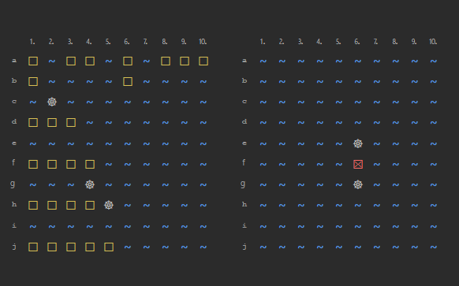
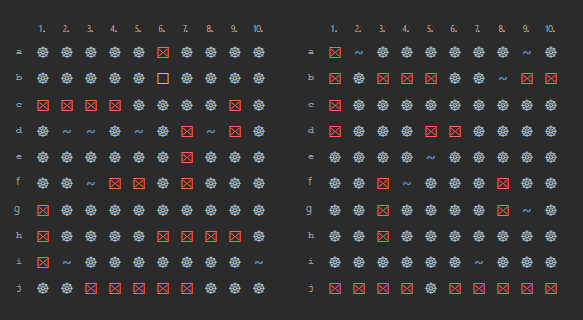
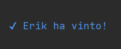

# Battleship Console Game
This is a console-based implementation of the classic game Battleship with an improved CLI graphics system.

## Getting Started
### Prerequisites
You will need to have Java 8+ installed on your computer to run this game.

### Installation
1. Clone or download this repository to your local machine.
2. Navigate to the project directory.
3. Compile the `Main.java` file by running the command `javac Main.java` in the terminal.
4. Run the game by entering the command `java Main` in the terminal.

## The Game
When you start the game the following menu appears on the home screen

>Type a number in the menu to continue

### Options available
  * Type '1' to start playing classical game 10x10 vs the computer
  * Type '2' to simulate a computer vs computer game 10x10
  * Type '3' to see the rules and legend
  * Type '0' to exit

### How to win
  - Each player has a battlefield represented by a 10x10 grid (default) on which he places 8 ships, hidden from his opponent.
  - The goal of the game is to sink all the opposing ships! A ship is sunk when it is hit once for each space it occupies.
  - In other words, a submarine, which occupies two spaces, is sunk after being hit twice.
  - The 8 ships occupy 25 total spaces, so the first player to record 25 hits wins!

### Place your ships

To place a ship you need to enter a departure coordinate (A1-J10 for the default 10x10 board) and a direction (vertical or horizontal).
- For example: "A1" and 'H' or "B7" and 'V'. 

Ships shall not overlap or be adjacent and shall remain within the boundaries of the edge.

### Shoot the enemy ships
Once both players have configured their ships, the battle may have started!
- Shoot your opponent’s ships by matching the coordinates.
- You will be informed if you have hit or missed a ship.
- Sink all 8 computer ships to win!

### End game
This is a possible scenario of an end game. 
The rules and legend of the symbols are explained in detail in point 3 of the menu. Consult anytime if you have any doubts.

### Feedback
If you have any feedback, please reach out to us at gurzau10@gmail.com

### License
[MIT](https://choosealicense.com/licenses/mit/)
