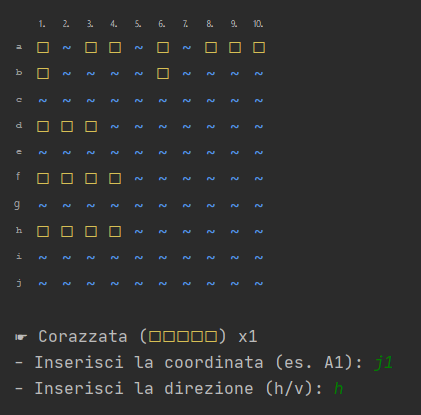

# battleship-console-terminal
Java battleship game using console terminal with classical rules but with an improved CLI graphics system

### Installation
To run the game you need to have:
* Versions after Java 8

### The Game
When you start the game the following menu appears on the home screen

>Type a number in the menu to continue

### Options available
  * Type '1' to start playing classical game 10x10 vs the computer
  * Type '2' to simulate a computer vs computer game 10x10
  * Type '3' to see the rules and legend
  * Type '0' to exit

### Place your ships

To place a ship you need to enter a departure coordinate (A1-J10 for the default 10x10 board) and a direction (vertical or horizontal).
- For example: "A1" and 'H' or "B7" and 'V'. 

Ships shall not overlap or be adjacent and shall remain within the boundaries of the edge.

### Shoot the enemy ships

### Feedback
If you have any feedback, please reach out to us at gurzau10@gmail.com

### License
[MIT](https://choosealicense.com/licenses/mit/)
